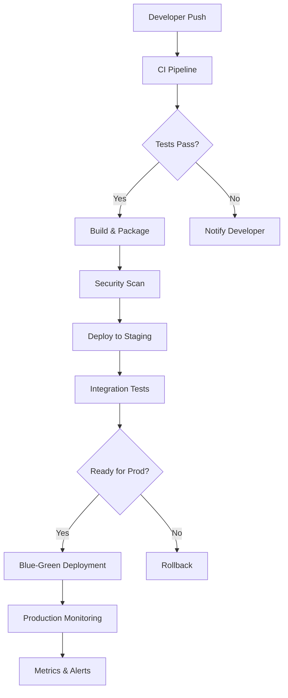

# 🚀 Nishant Chaudhary | DevOps Engineer

<div align="center">


[](https://github.com/NishantChaudhary1)
[](https://linkedin.com/in/nishantchaudhary1/)
[](tel:9167410877)

</div>

---

## 👨‍💻 About Me

```yaml
apiVersion: v1
kind: DevOpsEngineer
metadata:
  name: nishant-chaudhary
  labels:
    role: "Senior DevOps Engineer"
    experience: "3+ years"
    location: "India"
spec:
  specializations:
    - Infrastructure as Code
    - CI/CD Pipeline Development
    - Kubernetes & Container Orchestration
    - Cloud Architecture (AWS/Azure/GCP)
    - Monitoring & Observability
  mindset: "Automate Everything, Monitor Everything, Scale Everything"
```

---

## 🛠️ Tech Arsenal

<div align="center">

### ☁️ Cloud Platforms


### 🐳 Container & Orchestration


### 🏗️ Infrastructure as Code


### 🔄 CI/CD & Version Control


### 📊 Monitoring & Observability


### 💾 Databases & Message Queues


### 🐧 Operating Systems & Shell


</div>

---

## 🏗️ Architecture Philosophy



---

## 📈 GitHub Analytics

<div align="center">


</div>

---

## 💼 Professional Experience

<div align="center">

### 🏥 **Biofourmis** - *DevOps Engineer* 
**Nov 2023 - Present**
```yaml
responsibilities:
  - Implemented robust automation system for Production & Disaster Recovery clusters
  - Achieved 99.99% uptime with EKS cluster maintenance across 80+ microservices  
  - Deployed comprehensive healthcare data integration platform via Mirth
  - Led transformation of 50+ microservices from EC2 to cloud-based Kubernetes
  - Deployed KeyCloak SSO reducing login-related support tickets by 40%
```

### 🔧 **Exotel** - *Member of Technical Staff (DevOps)-2*
**May 2022 - Nov 2023**
```yaml
responsibilities:
  - Deployed SaaS products across AWS environments ensuring high availability
  - Automated infrastructure with Ansible and Terraform on EC2
  - Improved monitoring framework with Grafana and Prometheus
  - Orchestrated EKS cluster maintenance achieving 99.99% uptime
  - Created fully automated CI/CD pipelines for code deployment using Jenkins
```

### 💻 **Capgemini Technology Services India Limited** - *Senior Software Engineer*
**Oct 2020 - April 2022**
```yaml
responsibilities:
  - Designed and developed AWS solutions for large-scale clients
  - Pioneered use of CloudFormation and Terraform for service deployment
  - Authored shared library to enhance CI/CD Jenkins pipeline
  - Implemented pipeline for migrating zip files from Nexus repository to AWS S3
  - Strong proficiency in Python for automation and AWS Lambda development
```

</div>

---

## 🎯 Key Achievements

```yaml
achievements:
  infrastructure_reliability:
    - "Achieved 99.99% uptime with EKS cluster maintenance across 80+ microservices"
    - "Decreased synchronization errors by 40% through robust automation system"
    - "Enhanced fault tolerance across multiple environments with Kafka clusters"
  
  performance_optimization:
    - "Reduced infrastructure costs by 20% with Karpenter-managed nodegroups"
    - "Reduced deployment time by 30% with Jenkins hosted on EKS cluster"
    - "Achieved near real-time latency with self-hosted ELK on EKS"
    - "Improved client onboarding time by 50% via Mirth integration platform"
  
  automation_and_scalability:
    - "Led transformation of 50+ microservices from EC2 to cloud-based Kubernetes"
    - "Enhanced scalability to support 5x user growth"
    - "Transitioned workloads from spot.io to optimized infrastructure costs"
  
  security_and_compliance:
    - "Deployed KeyCloak SSO reducing login-related support tickets by 40%"
    - "Implemented comprehensive healthcare data integration platform"
    - "Streamlined authentication processes across multiple services"
```

---

## 🌟 DevOps Metrics Dashboard

<div align="center">

| Metric | Value | Status |
|--------|-------|--------|
| 🚀 **Deployment Frequency** | Multiple per day |  |
| ⏱️ **Lead Time** | < 1 hour |  |
| 🔄 **MTTR** | < 30 minutes |  |
| 📊 **Change Failure Rate** | < 5% |  |
| ⏰ **Uptime** | 99.9% |  |

</div>

---

## 🏆 Certifications & Skills

<div align="center">

### 🎖️ Certifications
- 🔸 **AWS Certified Developer - Associate**
- 🔸 **Bachelor of Technology (CSE) - ABES Engineering College, AKTU/UPTU**

### 💪 Core Competencies
```
Infrastructure Automation  ████████████████████ 95%
Container Orchestration    ██████████████████   90%
CI/CD Pipeline Design      ███████████████████  93%
Cloud Architecture         ██████████████████   88%
Monitoring & Observability █████████████████    85%
Security & Compliance      ████████████████     80%
```

</div>

---

## 📊 Current Focus Areas

<div align="center">

### 🎯 2024 Goals
- 🔹 **GitOps Implementation**: Moving towards GitOps workflows with ArgoCD
- 🔹 **Service Mesh**: Implementing Istio for microservices communication
- 🔹 **Chaos Engineering**: Building resilient systems with fault injection
- 🔹 **FinOps**: Advanced cloud cost optimization strategies

</div>

---

## 🤝 Let's Connect & Collaborate

<div align="center">

```bash
# Let's build something amazing together! 🚀
echo "DevOps is not just a role, it's a mindset of continuous improvement"

# Always open to discuss:
topics=(
  "Infrastructure Architecture"
  "Cloud Migration Strategies" 
  "DevOps Best Practices"
  "Team Leadership"
  "Open Source Contributions"
)
```

### 📞 Get In Touch

[](mailto:nishantc121@gmail.com)
[](https://linkedin.com/in/nishantchaudhary1/)
[](https://github.com/NishantChaudhary1)
[](tel:9167410877)

</div>

---

<div align="center">

### 💝 Support My Work

If you find my work helpful, consider:
- ⭐ Starring my repositories
- 🍴 Forking interesting projects
- 📢 Sharing with your network
- 💬 Providing feedback

**"Infrastructure is the foundation of innovation"** 🏗️


</div>

---

<div align="center">
<sub>Last updated: December 2024 | Made with ❤️ and lots of ☕</sub>
</div>
